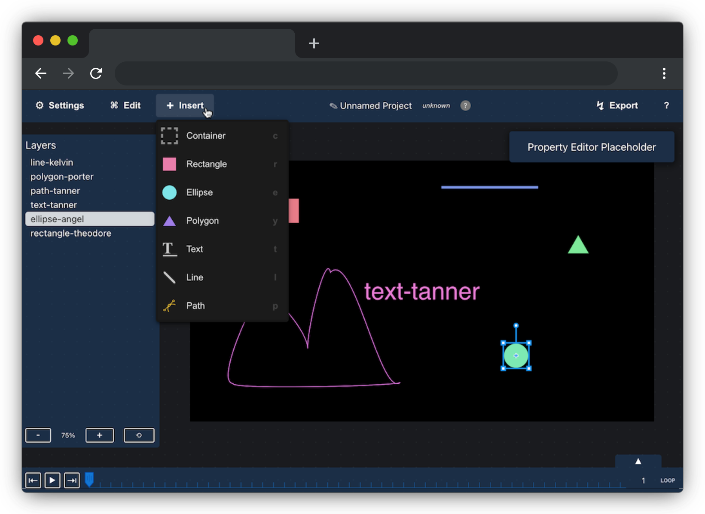

# Micro Graph
A vector-based motion graphics animation tool that enables rapid development with an intuitive user interface.

It is free and open-source, meant to enable creators with easy access to a powerful tool directly in their web browser.


*A snapshot of the current app, still very much in development*

---

## Development

Setup

```sh
git clone thisrepo
npm install
```

Run

```sh
npm start
# open browser to localhost:3000
```
