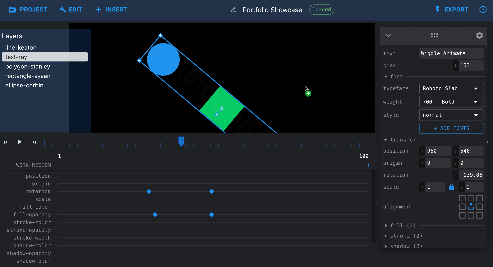

# Wiggle Animate
A vector-based motion graphics animation tool that enables rapid development with an intuitive user interface.

It is free and open-source, meant to enable creators with easy access to a powerful tool directly in their web browser.



---

## Development

Setup

```sh
npm install
```

Run

```sh
npm start
```
